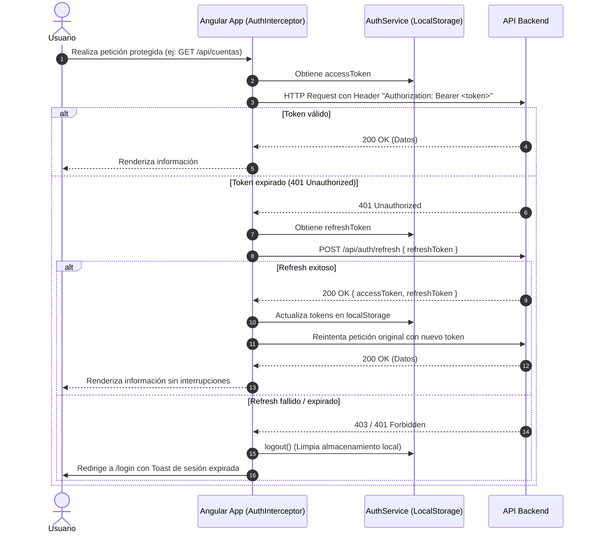

# 💰 Monetra - Gestor de Finanzas Personales (Frontend)

<p align="center">
  <a href="README.md">English</a> •
  <b>Español</b>
</p>

<p align="center">
  
  
  
  
  
  
</p>

---

## 📌 Descripción General

**Monetra** es una Single Page Application (SPA) moderna, intuitiva y de alto rendimiento diseñada para la gestión integral de finanzas personales. Permite a los usuarios administrar múltiples cuentas (efectivo, débito y tarjetas de crédito), registrar y categorizar transacciones, realizar transferencias interbancarias, pagar líneas de crédito y analizar tendencias financieras mediante métricas en tiempo real y gráficos interactivos sin dependencias externas pesadas.

El proyecto está construido bajo los estándares más recientes del ecosistema **Angular 21**, aprovechando componentes independientes (*Standalone Components*), el nuevo motor de control de flujo (`@if`, `@for`), reactividad híbrida con *Signals* y *RxJS*, guards e interceptores funcionales, y una arquitectura desacoplada y orientada al dominio (*Feature-Driven Clean Architecture*).

---

## 🚀 Características Principales

### 🔐 1. Seguridad & Autenticación
* **Flujo de sesión JWT**: Manejo seguro de `accessToken` y `refreshToken` persistidos en `localStorage`.
* **Rotación transparente de Tokens**: `AuthInterceptor` intercepta respuestas `401 Unauthorized` e invoca automáticamente `/api/auth/refresh` sin interrumpir la experiencia del usuario.
* **Control de Rutas**: Implementación de guards funcionales:
  * `authGuard`: Protege rutas internas comprobando la existencia de credenciales activas.
  * `guestGuard`: Redirige usuarios con sesión activa directamente al dashboard si intentan entrar al login o registro.
* **Flujos de cuenta completos**: Registro, inicio de sesión, recuperación de contraseña olvidada (`forgot-password`), restablecimiento con token (`reset-password`) y reenvío de activación de cuenta.

### 💳 2. Gestión de Cuentas Financieras
* **Tipos de Cuenta**: Soporte para **Efectivo**, **Débito** y **Tarjetas de Crédito**.
* **Gestión de Tarjetas de Crédito**:
  * Configuración de límite de crédito, día de corte y día límite de pago.
  * Cálculo dinámico de saldo disponible, crédito utilizado y porcentaje de endeudamiento con barras de progreso visuales.
  * Flujo especializado para **Pago de Tarjeta** con validación de saldo disponible y deuda máxima.
* **Personalización Visual**: Selector de colores hexadecimales para identificación inmediata de cuentas en tarjetas tipo "bancarias".
* **Actualización Optimista**: Activación/desactivación de cuentas con actualización instantánea en la UI y reversión automática (*rollback*) en caso de fallo del backend.

### 💸 3. Transacciones y Movimientos
* **Registro Flexible**: Creación de ingresos y egresos con asignación de cuentas, etiquetas, montos y notas opcionales.
* **Transferencias entre Cuentas**: Movimiento de saldos entre cuentas propias con validación de fondos y generación coordinada de transacciones.
* **Vista Global de Movimientos (`/movimientos`)**:
  * Filtrado avanzado multidimensional: por periodo predefinido (7 días, 30 días, este mes, mes anterior), rango de fechas personalizado, tipo de movimiento (ingreso/egreso), cuenta origen y múltiples etiquetas.
  * Selector para incluir u ocultar transferencias entre cuentas.
  * Buscador en vivo con normalización de caracteres diacríticos (acentos).
  * Ordenamiento dinámico por columnas (fecha, descripción, monto, etiquetas).
  * Cálculo automático de totales filtrados (entradas, salidas y balance neto).
* **Vista Responsive Adaptable**: Renderizado en tabla estructurada para escritorio y tarjetas compactas optimizadas para dispositivos móviles.
* **Confirmación Segura de Eliminación**: Integración de **SweetAlert2** con estilos a medida para confirmar borrados de movimientos individuales o transferencias bilaterales.

### 📊 4. Módulo de Análisis Financiero (`/analisis`)
* **Métricas Clave**: Indicadores de ingresos totales, egresos, balance neto y **tasa de ahorro** porcentual.
* **Gráfica de Tendencia Nativa**: Visualización de ingresos vs. gastos construida enteramente en HTML/CSS y Tailwind, optimizada para rendimiento y sin sobrecarga de bibliotecas de gráficos externas.
* **Desglose de Gastos por Categoría**: Porcentajes de participación, barras proporcionales y variación comparativa.
* **Insights Automatizados**: Alertas y recomendaciones inteligentes (tipo `success`, `warning`, `info`) según el comportamiento financiero del usuario.
* **Comparativa Histórica Mensual**: Tabla cronológica del desempeño de los últimos meses.

### ⚙️ 5. Configuración & Perfil (`/configuracion`)
* **Perfil de Usuario**: Actualización de nombre y apellido, con sincronización reactiva hacia la barra lateral y navbar.
* **Carga de Avatar**: Carga y previsualización local de imagen (`JPEG`, `PNG`, `WebP` de hasta 2 MB) con subida multipart hacia el servidor.
* **Seguridad de Acceso**: Formulario de cambio de contraseña con validación de contraseña actual y requisitos mínimos.
* **Gestión de Etiquetas**: Creación y eliminación de etiquetas personalizadas con selección de paleta de color para clasificar transacciones.

### 🌓 6. Experiencia de Usuario & Diseño (UX/UI)
* **Dark Mode Completo**: Soporte nativo para modo oscuro persistente en `localStorage` sincronizado con Tailwind CSS.
* **Global Loading Inteligente**:
  * Detección de latencia con debounce de 700 ms para evitar parpadeos en peticiones rápidas.
  * Detector de respuestas lentas (> 6 s) para informar al usuario cuando la API está realizando un *cold start* en plataformas de hosting gratuito (e.g. Render).
* **Feedback Inmediato**: Sistema reactivo de notificaciones tipo *Toast* (`ToastService`) basado en Angular Signals.

---

## 🛠️ Stack Tecnológico

| Capa | Tecnología | Versión | Propósito |
| :--- | :--- | :--- | :--- |
| **Core Framework** | [Angular](https://angular.dev/) | `^21.1.0` | Framework SPA principal con Standalone Components |
| **Lenguaje** | [TypeScript](https://www.typescriptlang.org/) | `~5.9.2` | Tipado estático estricto y tooling moderno |
| **Estilos & Utility** | [Tailwind CSS](https://tailwindcss.com/) | `^4.1.12` | Motor de estilos de última generación con PostCSS |
| **Componentes UI** | [Flowbite](https://flowbite.com/) | `^4.0.1` | Primitivas UI accesibles e interactivas |
| **Selector de Fechas** | [flowbite-datepicker](https://flowbite.com/docs/plugins/datepicker/) | `^2.0.0` | Componente nativo de selección de calendarios |
| **Gestión de Estado** | [RxJS](https://rxjs.dev/) + [Signals](https://angular.dev/guide/signals) | `~7.8.0` / Angular Core | Programación reactiva, eventos desacoplados y estado local |
| **Autenticación** | [jwt-decode](https://github.com/auth0/jwt-decode) | `^4.0.0` | Decodificación y extracción de claims de tokens JWT |
| **Alertas & Modales** | [SweetAlert2](https://sweetalert2.github.io/) | `^11.26.25` | Modales de confirmación con diseño adaptado |
| **Pruebas Unitarias** | [Vitest](https://vitest.dev/) | `^4.0.8` | Test runner moderno mediante `@angular/build:unit-test` |
| **Despliegue** | [Vercel](https://vercel.com/) | - | Hosting estático optimizado con soporte para SPA rewrites |

---

## 📂 Arquitectura de Carpetas

El proyecto sigue una estructura limpia orientada a dominios (*Feature-Based Clean Architecture*):

```text
frontend-gestor-gastos/
├── docs/                             # Documentación técnica de contexto funcional y endpoints
│   ├── CONTEXTO_ANALISIS.md
│   ├── CONTEXTO_CONFIGURACION.md
│   ├── CONTEXTO_CUENTAS_USUARIO.md
│   └── CONTEXTO_DETALLE_CUENTA.md
├── public/                           # Activos estáticos públicos (logos, favicons, iconos)
├── src/
│   ├── app/
│   │   ├── core/                     # Servicios singleton, guards y modelos globales
│   │   │   ├── guards/               # authGuard y guestGuard funcionales
│   │   │   ├── models/               # Interfaces de TypeScript (análisis, balances, categorías)
│   │   │   └── services/             # AuthService, CuentasService, MovimientosService, etc.
│   │   ├── features/                 # Módulos de funcionalidad de negocio (vistas y modales)
│   │   │   ├── analisis/             # Pantalla de métricas y gráficos financieros
│   │   │   ├── auth/                 # Login, Registro, Recuperación de contraseña, Activación
│   │   │   ├── components/           # Modales de negocio (crear cuenta, nuevo movimiento, transferencias)
│   │   │   ├── cuenta-detalle/       # Vista detallada de una cuenta específica y su historial
│   │   │   ├── cuentas/              # Vista de catálogo y administración de cuentas
│   │   │   ├── dashboard/            # Panel principal de bienvenida, balance y accesos rápidos
│   │   │   ├── movimientos/          # Historial global de transacciones y filtros avanzados
│   │   │   ├── not-found/            # Vista de error 404
│   │   │   └── settings/             # Configuración de perfil, clave y etiquetas
│   │   ├── interceptors/             # Interceptores HTTP (AuthInterceptor y LoadingInterceptor)
│   │   ├── layout/                   # Shell principal (Sidebar responsive, Navbar, perfil y Dark Mode)
│   │   ├── shared/                   # Componentes UI reutilizables y utilidades puras
│   │   │   ├── account-card/         # Tarjeta de cuenta bancaria física estilizada
│   │   │   ├── balance-general/      # Componente de visualización de saldo total
│   │   │   ├── global-loader/        # Loader global y feedback de servidor lento
│   │   │   ├── modal/                # Componente de modal base con animaciones
│   │   │   ├── quick-action/         # Botones de accesos rápidos del dashboard
│   │   │   ├── toast/                # Componente visual para alertas efímeras
│   │   │   ├── ultimos-movimientos/  # Listado compacto de transacciones recientes
│   │   │   └── utils/                # Funciones de parseo de fechas locales y estilos de SweetAlert
│   │   ├── app.config.ts             # Configuración principal de Angular (Providers, HTTP, Router)
│   │   ├── app.routes.ts             # Definición centralizada de rutas de la aplicación
│   │   └── app.ts                    # Componente raíz de la aplicación
│   ├── environments/                 # Configuraciones de entorno (local vs producción)
│   │   ├── environment.ts            # Entorno de desarrollo (http://localhost:3000)
│   │   └── environment.prod.ts       # Entorno de producción (API desplegada)
│   ├── index.html                    # Entrada HTML principal
│   ├── main.ts                       # Punto de arranque de Angular (bootstrapApplication)
│   └── styles.css                    # Configuración global de Tailwind v4, fuentes y animaciones
├── angular.json                      # Configuración del CLI de Angular y presupuestos de build
├── package.json                      # Dependencias del proyecto y scripts npm
├── tsconfig.json                     # Configuración base de TypeScript
└── vercel.json                       # Configuración de redirecciones SPA para Vercel
```

---

## 🔄 Flujos Arquitectónicos Clave

### 1. Ciclo de Autenticación y Renovación de Tokens



### 2. Sincronización Reactiva de Saldos (*Event-Driven State Refresh*)
En lugar de forzar recargas completas de la página, los servicios `CuentasService` y `MovimientosService` utilizan instancias internas de `Subject<void>` (`refreshBalanceObservable$`). Cuando una acción altera el saldo (crear movimiento, editar transacción, transferir entre cuentas o pagar una tarjeta), los componentes dependientes (`BalanceGeneral`, `UltimosMovimientos`, listas de cuentas) son notificados de manera reactiva para volver a consultar sus datos de forma granular.

### 3. Detección Inteligente de Latencia (*Cold Starts*)
El `LoadingInterceptor` trabaja en conjunto con `LoadingService`:
1. **0 a 700 ms**: No se muestra loader en pantalla (evita parpadeos en peticiones ultrarrápidas).
2. **> 700 ms**: Se despliega una barra de progreso superior discreta y un indicador de carga.
3. **> 6.000 ms**: El indicador de carga conmuta automáticamente su mensaje a: *"Esto está tomando más de lo normal..."*, informando al usuario sobre reactivaciones de instancias en reposo del backend.

---

## 📡 Resumen de Endpoints del Backend

La aplicación consume una API REST centralizada. Los endpoints principales organizados por módulo son:

### Autenticación (`/api/auth`)
* `POST /api/auth/login`: Autenticación con credenciales (retorna `accessToken` y `refreshToken`).
* `POST /api/auth/register`: Registro de nuevas cuentas de usuario.
* `POST /api/auth/refresh`: Renovación del token de acceso mediante el refresh token.
* `POST /api/auth/forgot-password`: Envío de correo con instrucciones de recuperación.
* `POST /api/auth/reset-password`: Restablecimiento de contraseña utilizando token.
* `POST /api/auth/resend-activation`: Reenvío de correo de activación de cuenta.
* `GET /api/auth/perfil`: Consulta de los datos del perfil autenticado.
* `PATCH /api/auth/perfil`: Actualización de nombre y apellido.
* `PATCH /api/auth/perfil/avatar`: Carga y actualización de imagen de perfil (`FormData`).
* `PATCH /api/auth/cambiar-contrasena`: Modificación de contraseña del usuario.

### Cuentas (`/api/cuentas`)
* `GET /api/cuentas`: Listado general de cuentas del usuario.
* `GET /api/cuentas/activas`: Listado de cuentas con estatus activo habilitadas para operaciones.
* `POST /api/cuentas`: Creación de cuenta (Efectivo, Débito o Crédito).
* `PATCH /api/cuentas/edit/:id`: Actualización de configuración de la cuenta.
* `PATCH /api/cuentas/update-status`: Modificación de estado activo/inactivo (`{ id_cuenta, status }`).
* `POST /api/cuentas/transferir-saldo`: Ejecución de transferencia de fondos o pago de tarjeta.
* `PATCH /api/cuentas/transferir-saldo/edit/:id`: Edición de transferencia existente.

### Movimientos & Categorías (`/api/movimientos`)
* `GET /api/movimientos`: Consulta general de transacciones con soporte de parámetros de búsqueda y filtro.
* `GET /api/movimientos/ultimos-movimientos`: Resumen de las últimas transacciones registradas.
* `GET /api/movimientos/cuenta/:id`: Historial exclusivo de transacciones pertenecientes a una cuenta.
* `POST /api/movimientos`: Registro de nuevo ingreso o gasto.
* `PATCH /api/movimientos/edit/:id`: Edición de un movimiento existente.
* `DELETE /api/movimientos/:id`: Eliminación de un movimiento o anulación de transferencia.
* `GET /api/movimientos/balance-general`: Obtención del balance total acumulado.
* `GET /api/movimientos/etiquetas`: Consulta de etiquetas disponibles.
* `POST /api/movimientos/etiquetas`: Creación de etiqueta personalizada.
* `DELETE /api/movimientos/etiquetas/:id`: Eliminación de etiqueta personalizada.
* `GET /api/movimientos/tipos-movimiento`: Catálogo de tipos de transacción.

### Análisis Financiero (`/api/analisis`)
* `GET /api/analisis?periodo=:periodo&cuentaId=:cuentaId`: Obtención de resumen financiero, tendencias comparativas, distribución por categorías, comparativa histórica e insights.

---

## 💻 Entorno de Desarrollo y Puesta en Marcha

### Prerrequisitos
Asegúrate de contar con el siguiente software instalado en tu estación de trabajo:
* [Node.js](https://nodejs.org/): versión `>= 20.x` recomendada.
* [npm](https://www.npmjs.com/): versión `>= 10.x` o superior.
* [Angular CLI](https://angular.dev/tools/cli): `^21.1.0` (opcional, disponible a través de scripts de `npm`).

### 1. Clonar el Repositorio
```bash
git clone https://github.com/Kvn482/frontend-gestor-gastos.git
cd frontend-gestor-gastos
```

### 2. Instalar Dependencias
```bash
npm install
```

### 3. Configuración de Variables de Entorno
Verifica los archivos de configuración en `src/environments/`:

* `src/environments/environment.ts` (Desarrollo local):
```typescript
export const environment = {
  production: false,
  apiUrl: 'http://localhost:3000',
};
```

* `src/environments/environment.prod.ts` (Producción):
```typescript
export const environment = {
  production: true,
  apiUrl: 'https://monetra-mlqi.onrender.com',
};
```

### 4. Iniciar el Servidor de Desarrollo
```bash
npm start
# O directamente mediante el CLI:
# ng serve
```
Navega en tu navegador a `http://localhost:4200/`. La aplicación se recargará automáticamente ante cualquier modificación en el código fuente.

---

## 🧪 Pruebas & Calidad de Código

### Ejecución de Pruebas Unitarias
El proyecto utiliza **Vitest** como test runner integrado con el builder `@angular/build:unit-test`.

```bash
# Ejecutar suite de pruebas unitarias
npm test

# Ejecutar pruebas en modo único (single run / CI)
npm test -- --watch=false
```

### Compilación y Construcción para Producción
```bash
npm run build
```
Los artefactos compilados y optimizados se generarán en el directorio `dist/gestor-gastos`. La compilación de producción incluye minificación, reemplazo de entornos, eliminación de código muerto (*tree-shaking*) y verificación de presupuestos de tamaño de bundle (*budgets*).

---

## 🚀 Despliegue (Deployment)

El proyecto está preconfigurado para ser desplegado de manera directa en plataformas como **Vercel**, **Netlify** o **Cloudflare Pages**.

### Configuración en Vercel
El archivo `vercel.json` en la raíz garantiza que el enrutamiento del lado del cliente (HTML5 PushState) funcione sin errores `404` al recargar rutas profundas:

```json
{
  "rewrites": [
    {
      "source": "/(.*)",
      "destination": "/"
    }
  ]
}
```

* **Framework Preset**: `Angular`
* **Build Command**: `npm run build`
* **Output Directory**: `dist/gestor-gastos/browser` (o `dist/gestor-gastos` según versión del builder)
* **Node Version**: `20.x` o superior

---

## 📈 Buenas Prácticas & Mejoras Futuras (Roadmap Técnico)

Como recomendación de ingeniería senior para la evolución y escalabilidad del proyecto:

1. **Gestión de Estado Centralizada**: A medida que crezca el número de vistas dependientes del saldo y catálogo de cuentas, evaluar la adopción formal de **NgRx SignalStore** o `@ngrx/signals` para sustituir los `Subject` distribuidos por un store declarativo e inmutable.
2. **Unificación de Modelos (Categorías vs. Etiquetas)**: Unificar la definición de tipos en `src/app/core/models/` para homogeneizar los contratos entre `/api/movimientos/etiquetas` (`CategoriasResponse`) y las interfaces locales que esperan `{ nombre, color }`.
3. **Lazy Loading de Rutas**: Implementar `loadComponent` con importaciones dinámicas en `src/app/app.routes.ts` para las vistas pesadas (`analisis`, `cuenta-detalle`, `movimientos`), reduciendo el tamaño del chunk inicial (*initial budget*).
4. **Optimización de Bundle de Terceros**: Evaluar alternativas modulares o configuración específica de build para dependencias CommonJS como `sweetalert2`, eliminando warnings de optimización durante el empaquetado.

---

## 👨‍💻 Autor y Licencia

Desarrollado con pasión por el equipo de **Monetra**.  
Distribuido bajo la licencia [MIT](LICENSE).

