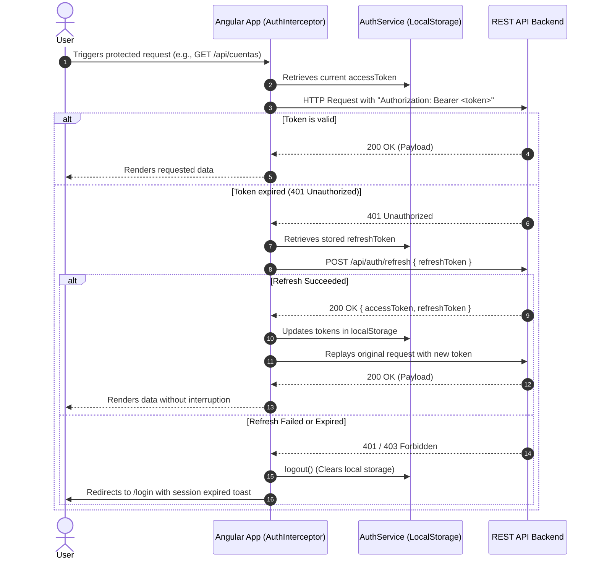

# 💰 Monetra - Personal Finance Tracker (Frontend)

<p align="center">
  <b>English</b> •
  <a href="README.es.md">Español</a>
</p>

<p align="center">
  
  
  
  
  
  
</p>

---

## 📌 Overview

**Monetra** is a modern, responsive, high-performance Single Page Application (SPA) designed for comprehensive personal wealth and expense management. It empowers users to manage multi-type financial accounts (Cash, Debit, and Credit Cards), record and categorize income/expenses, perform internal account transfers, make credit line payments, and gain financial clarity through real-time analytics and native interactive charts.

Built under the latest standards of the **Angular 21** ecosystem, the application leverages **Standalone Components**, the built-in control flow syntax (`@if`, `@for`), hybrid reactivity via **Angular Signals** and **RxJS**, functional guards/interceptors, and a domain-oriented **Feature-Driven Clean Architecture**.

---

## 🚀 Key Features

### 🔐 1. Authentication & Security
* **JWT Session Management**: Secure storage and handling of `accessToken` and `refreshToken` persisted in `localStorage`.
* **Seamless Token Rotation**: An HTTP `AuthInterceptor` captures `401 Unauthorized` responses and silently requests new tokens via `/api/auth/refresh` without disrupting the user journey.
* **Functional Route Guards**:
  * `authGuard`: Protects private workspace routes by verifying active token sessions.
  * `guestGuard`: Prevents authenticated users from accessing login, registration, and recovery pages by redirecting them to `/inicio`.
* **Full Authentication Lifecycle**: User registration, login, forgot password flow (`forgot-password`), token-based password reset (`reset-password`), and account activation email resend.

### 💳 2. Multi-Type Account Management
* **Supported Account Types**: Full support for **Cash**, **Debit**, and **Credit Cards**.
* **Credit Card Line Intelligence**:
  * Configurable credit limits, billing statement cutoff days, and payment due days.
  * Real-time calculation of available credit, utilized credit, and debt utilization percentages with visual indicators.
  * Specialized **Credit Card Payment Modal** enforcing origin funds availability and maximum balance caps.
* **Visual Personalization**: Hexadecimal color pickers allowing users to style cards to match real-world bank aesthetics.
* **Optimistic Status Toggling**: Instant UI state changes when enabling/disabling accounts, with automatic rollback upon backend failure.

### 💸 3. Transactions & Ledger Management
* **Flexible Transaction Entry**: Quick modal creation for income and expenses, supporting account assignment, category tags, amounts, and optional notes.
* **Inter-Account Transfers**: Move funds between personal accounts with source balance validation and synchronized transaction pair generation.
* **Global Transactions Ledger (`/movimientos`)**:
  * **Multidimensional Filtering**: Filter by predefined timeframes (7 days, 30 days, this month, last month), custom date ranges, movement types (income/expense), origin accounts, and tag combinations.
  * **Internal Transfer Toggle**: Seamlessly isolate or display internal movements.
  * **Live Search**: Real-time filtering across descriptions and notes with diacritic/accent normalization.
  * **Column Sorting**: Interactive sorting across date, description, amount, and tags in ascending/descending order.
  * **Dynamic Financial Summary**: Instant metric cards calculating filtered income, expenses, and net cash flow.
* **Responsive Multi-Device Layout**: Desktop data table view and compact touch-friendly cards for mobile devices.
* **Safe Deletion Safeguards**: Custom-themed **SweetAlert2** modals providing clear warnings when deleting regular transactions vs. linked bilateral transfers.

### 📊 4. Financial Analytics Engine (`/analisis`)
* **Core KPI Metrics**: Real-time summaries for total income, total expenses, net balance, and **savings rate** percentage.
* **Native Trend Charting**: Income vs. Expense monthly progression built with clean, zero-dependency HTML5/CSS and Tailwind, eliminating bulky third-party chart dependencies.
* **Category Breakdown**: Categorical expense distribution with visual progress bars, percentage shares, and comparative variations.
* **Automated Insights**: Heuristic financial alerts and tips (`success`, `warning`, `info`) triggered by user spending habits.
* **Monthly Comparative History**: Chronological table comparing historical performance across previous months.

### ⚙️ 5. User Settings & Customization (`/configuracion`)
* **Personal Profile**: Update first and last name with real-time reactive sync to navbar and sidebar profile views.
* **Avatar Upload**: Client-side image selection and instant preview (`JPEG`, `PNG`, `WebP` up to 2 MB) with `multipart/form-data` upload support.
* **Security & Credentials**: Secure password update form enforcing current password validation and strength rules.
* **Custom Tags & Categories**: Full CRUD for personal expense/income tags with a custom color palette.

### 🌓 6. User Experience & Design (UI/UX)
* **Full Dark Mode**: System-aware and manual dark mode persisted in `localStorage` and synchronized across Tailwind utility classes.
* **Intelligent Global Loading State**:
  * **700 ms Debounce**: Prevents UI flashing on fast network calls.
  * **Slow Server Detector (> 6 s)**: Displays a helpful status message (*"This is taking longer than usual..."*) informing users when the backend is performing a cold start on free-tier platforms (such as Render).
* **Signal-Driven Toast Notifications**: Lightweight, accessible toast notification queue (`ToastService`) powered by Angular Signals.

---

## 🛠️ Technology Stack

| Layer | Technology | Version | Purpose |
| :--- | :--- | :--- | :--- |
| **Core Framework** | [Angular](https://angular.dev/) | `^21.1.0` | Modern SPA framework with Standalone Components & New Control Flow |
| **Language** | [TypeScript](https://www.typescriptlang.org/) | `~5.9.2` | Static typing, modern syntax, and type safety |
| **Styling & Design** | [Tailwind CSS](https://tailwindcss.com/) | `^4.1.12` | Utility-first CSS engine powered by PostCSS |
| **UI Primitives** | [Flowbite](https://flowbite.com/) | `^4.0.1` | Accessible interactive UI components |
| **Date Pickers** | [flowbite-datepicker](https://flowbite.com/docs/plugins/datepicker/) | `^2.0.0` | Native calendar and datepicker plugin |
| **Reactivity & State** | [RxJS](https://rxjs.dev/) + [Signals](https://angular.dev/guide/signals) | `~7.8.0` / Core | Reactive event streams, observables, and local reactive state |
| **Authentication** | [jwt-decode](https://github.com/auth0/jwt-decode) | `^4.0.0` | Client-side JWT claim decoding and expiration validation |
| **Modals & Dialogs** | [SweetAlert2](https://sweetalert2.github.io/) | `^11.26.25` | Styled confirmation and alert modals |
| **Unit Testing** | [Vitest](https://vitest.dev/) | `^4.0.8` | High-speed testing runner via `@angular/build:unit-test` |
| **Deployment** | [Vercel](https://vercel.com/) | - | Production cloud hosting with SPA routing rewrites |

---

## 📂 Project Structure

The project follows a domain-driven, modular clean frontend architecture:

```text
frontend-gestor-gastos/
├── docs/                             # Functional context docs & backend API references
│   ├── CONTEXTO_ANALISIS.md
│   ├── CONTEXTO_CONFIGURACION.md
│   ├── CONTEXTO_CUENTAS_USUARIO.md
│   └── CONTEXTO_DETALLE_CUENTA.md
├── public/                           # Static assets, branding, and icons
├── src/
│   ├── app/
│   │   ├── core/                     # Singleton services, functional guards, and core models
│   │   │   ├── guards/               # Functional authGuard and guestGuard
│   │   │   ├── models/               # Domain interfaces (analytics, balance, categories)
│   │   │   └── services/             # AuthService, CuentasService, MovimientosService, etc.
│   │   ├── features/                 # Domain-specific feature modules (views & modals)
│   │   │   ├── analisis/             # Analytics dashboard and trend graphs
│   │   │   ├── auth/                 # Login, Register, Forgot Password, Activation flows
│   │   │   ├── components/           # Reusable feature modals (accounts, movements, transfers)
│   │   │   ├── cuenta-detalle/       # Detailed account ledger and credit card views
│   │   │   ├── cuentas/              # Account catalog and card management
│   │   │   ├── dashboard/            # Overview screen, balance widget, and quick actions
│   │   │   ├── movimientos/          # Global transaction ledger with advanced filtering
│   │   │   ├── not-found/            # 404 error page
│   │   │   └── settings/             # Profile, password, and custom tags settings
│   │   ├── interceptors/             # HTTP interceptors (AuthInterceptor & LoadingInterceptor)
│   │   ├── layout/                   # Application shell (responsive sidebar, navbar, dark mode)
│   │   ├── shared/                   # Generic UI widgets, dumb components, and utilities
│   │   │   ├── account-card/         # Bank-styled customizable account card
│   │   │   ├── balance-general/      # Total balance display card
│   │   │   ├── global-loader/        # Global progress bar and cold-start badge
│   │   │   ├── modal/                # Reusable accessible dialog modal base
│   │   │   ├── quick-action/         # Shortcut button components
│   │   │   ├── toast/                # Floating notification toast component
│   │   │   ├── ultimos-movimientos/  # Compact list of recent transactions
│   │   │   └── utils/                # Local date normalization and SweetAlert styles
│   │   ├── app.config.ts             # Central Angular providers, HTTP client, and routing
│   │   ├── app.routes.ts             # Declarative route configuration
│   │   └── app.ts                    # Application root component
│   ├── environments/                 # Environment configurations
│   │   ├── environment.ts            # Development environment (http://localhost:3000)
│   │   └── environment.prod.ts       # Production environment (Live API URL)
│   ├── index.html                    # Single-page HTML entry point
│   ├── main.ts                       # Application bootstrap point (bootstrapApplication)
│   └── styles.css                    # Tailwind CSS v4 directives, custom themes & animations
├── angular.json                      # Angular CLI configuration and build budgets
├── package.json                      # Dependencies and npm scripts
├── tsconfig.json                     # TypeScript compiler configuration
└── vercel.json                       # Vercel deployment rewrites for HTML5 PushState routing
```

---

## 🔄 Architectural Data Flows

### 1. Authentication & Token Refresh Flow



### 2. Event-Driven State Refresh
Rather than performing costly full-page reloads or broad invalidations, services like `CuentasService` and `MovimientosService` expose reactive `Subject<void>` observables (`refreshBalanceObservable$`). Whenever a balance-modifying action occurs (creating a transaction, editing an entry, transferring funds, or executing a credit card payment), subscriber components (`BalanceGeneral`, `UltimosMovimientos`, account cards) trigger targeted data refetches automatically.

### 3. Smart Network Latency Handling (*Cold Starts*)
The `LoadingInterceptor` coordinates with `LoadingService`:
1. **0 to 700 ms**: No loading overlay is rendered, preventing annoying micro-flickers on quick responses.
2. **> 700 ms**: An elegant top progress line and spinner badge appear.
3. **> 6,000 ms**: The notification copy dynamically changes to: *"This is taking longer than usual..."*, providing clear context during cloud server spin-ups.

---

## 📡 Backend API Endpoints Reference

The client integrates with a centralized RESTful backend API:

### Authentication (`/api/auth`)
* `POST /api/auth/login`: Authenticates credentials (returns `accessToken` and `refreshToken`).
* `POST /api/auth/register`: Signs up a new user account.
* `POST /api/auth/refresh`: Issues a renewed access token using a valid refresh token.
* `POST /api/auth/forgot-password`: Dispatches a password reset email.
* `POST /api/auth/reset-password`: Resets user password using an email token.
* `POST /api/auth/resend-activation`: Resends account verification email.
* `GET /api/auth/perfil`: Fetches profile information for the authenticated user.
* `PATCH /api/auth/perfil`: Updates profile details (first name, last name).
* `PATCH /api/auth/perfil/avatar`: Uploads and updates profile image (`FormData`).
* `PATCH /api/auth/cambiar-contrasena`: Changes user password.

### Accounts (`/api/cuentas`)
* `GET /api/cuentas`: Retrieves all user accounts.
* `GET /api/cuentas/activas`: Retrieves only currently active accounts.
* `POST /api/cuentas`: Creates a new account (Cash, Debit, or Credit).
* `PATCH /api/cuentas/edit/:id`: Updates an existing account's parameters.
* `PATCH /api/cuentas/update-status`: Toggles account active status (`{ id_cuenta, status }`).
* `POST /api/cuentas/transferir-saldo`: Executes inter-account transfer or card payment.
* `PATCH /api/cuentas/transferir-saldo/edit/:id`: Modifies an existing transfer.

### Transactions & Tags (`/api/movimientos`)
* `GET /api/movimientos`: Lists transactions with search and filter query parameters.
* `GET /api/movimientos/ultimos-movimientos`: Retrieves latest recent transactions.
* `GET /api/movimientos/cuenta/:id`: Retrieves transactions specific to one account.
* `POST /api/movimientos`: Records a new transaction (income/expense).
* `PATCH /api/movimientos/edit/:id`: Updates an existing transaction.
* `DELETE /api/movimientos/:id`: Deletes a movement or reverses a linked transfer.
* `GET /api/movimientos/balance-general`: Returns aggregated total balance.
* `GET /api/movimientos/etiquetas`: Fetches all available categorization tags.
* `POST /api/movimientos/etiquetas`: Creates a custom user tag.
* `DELETE /api/movimientos/etiquetas/:id`: Deletes a custom user tag.
* `GET /api/movimientos/tipos-movimiento`: Retrieves transaction types catalog.

### Analytics (`/api/analisis`)
* `GET /api/analisis?periodo=:periodo&cuentaId=:cuentaId`: Returns financial summary KPIs, trend series, category distribution, monthly historical data, and smart insights.

---

## 💻 Development & Getting Started

### Prerequisites
Make sure your environment meets the following requirements:
* [Node.js](https://nodejs.org/): version `>= 20.x` recommended.
* [npm](https://www.npmjs.com/): version `>= 10.x` or higher.
* [Angular CLI](https://angular.dev/tools/cli): `^21.1.0` (accessible through npm scripts).

### 1. Clone the Repository
```bash
git clone https://github.com/Kvn482/frontend-gestor-gastos.git
cd frontend-gestor-gastos
```

### 2. Install Dependencies
```bash
npm install
```

### 3. Environment Configuration
Inspect the environment files under `src/environments/`:

* `src/environments/environment.ts` (Local Development):
```typescript
export const environment = {
  production: false,
  apiUrl: 'http://localhost:3000',
};
```

* `src/environments/environment.prod.ts` (Production):
```typescript
export const environment = {
  production: true,
  apiUrl: 'https://monetra-mlqi.onrender.com',
};
```

### 4. Run Development Server
```bash
npm start
# Or using the Angular CLI directly:
# ng serve
```
Navigate to `http://localhost:4200/`. The app will automatically reload whenever source code changes are saved.

---

## 🧪 Testing & Code Quality

### Running Unit Tests
Unit testing is executed using **Vitest** through the `@angular/build:unit-test` builder.

```bash
# Run unit test suite in watch mode
npm test

# Run tests once (CI / Single Run)
npm test -- --watch=false
```

### Building for Production
```bash
npm run build
```
Optimized, production-ready assets will be generated inside the `dist/gestor-gastos` folder. The production build performs minification, environment replacement, dead-code elimination (*tree-shaking*), and bundle budget validations.

---

## 🚀 Deployment

The project is structured for zero-friction deployments on modern static hosting platforms like **Vercel**, **Netlify**, or **Cloudflare Pages**.

### Vercel Deployment
The repository includes a `vercel.json` file configuring routing rewrites so that HTML5 PushState routing works seamlessly without `404` errors:

```json
{
  "rewrites": [
    {
      "source": "/(.*)",
      "destination": "/"
    }
  ]
}
```

* **Framework Preset**: `Angular`
* **Build Command**: `npm run build`
* **Output Directory**: `dist/gestor-gastos/browser` (or `dist/gestor-gastos` depending on Angular builder setup)
* **Node Version**: `20.x` or higher

---

## 📈 Engineering Roadmap & Senior Recommendations

To ensure long-term maintainability and enterprise-scale readiness:

1. **Centralized State Store**: As cross-component interactions and dependencies increase, consider adopting **NgRx SignalStore** (`@ngrx/signals`) to transition from multi-service `Subject` event buses to declarative, immutable store slices.
2. **Contract Normalization (Categories vs. Tags)**: Consolidate data interfaces under `src/app/core/models/` to resolve contract discrepancies between `/api/movimientos/etiquetas` (`CategoriasResponse`) and local schemas expecting `{ nombre, color }`.
3. **Route-Level Code Splitting**: Migrate remaining eager route declarations in `src/app/app.routes.ts` to `loadComponent` dynamic imports for heavy views (`analisis`, `cuenta-detalle`, `movimientos`) to further optimize initial bundle size.
4. **Third-Party Bundle Optimization**: Configure Angular build options or explore ESM-native alternatives for CommonJS modules such as `sweetalert2` to eliminate optimization warnings during production builds.

---

## 👨‍💻 Authors & License

Developed with passion by the **Monetra** engineering team.  
Distributed under the [MIT](LICENSE) License.
